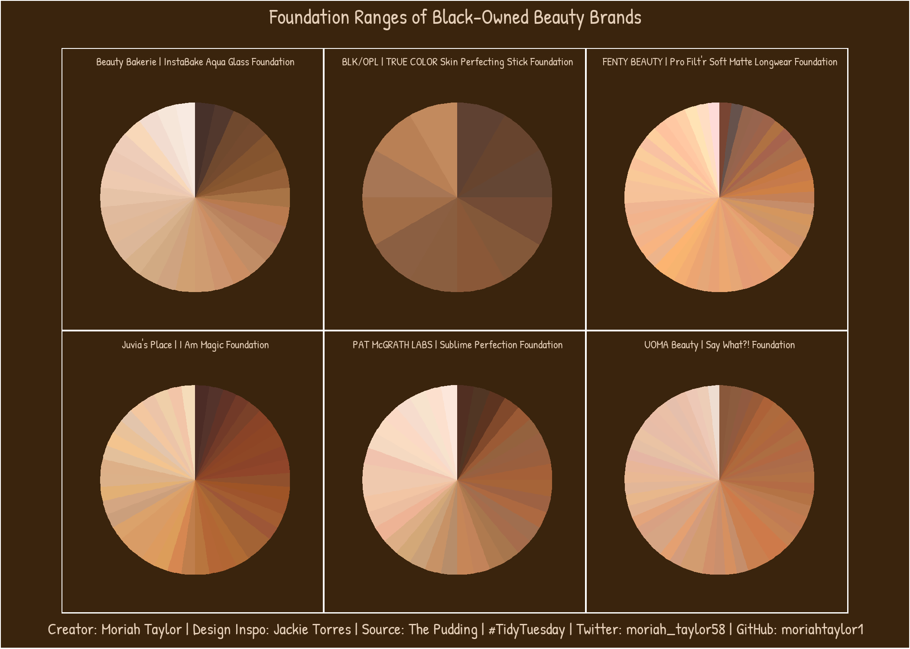
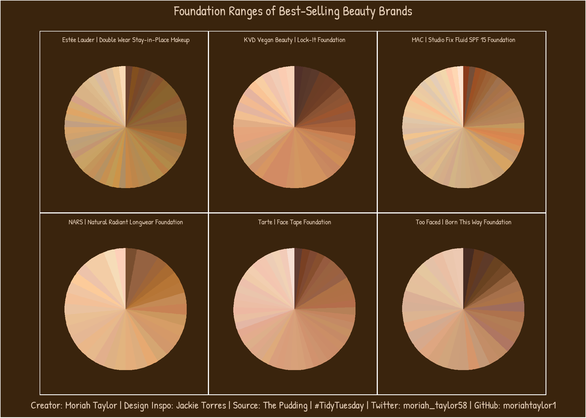

# This Week's Data - Makeup Shades

The data this week comes from [The Pudding](https://github.com/the-pudding/data/tree/master/foundation-names). They have a corresponding [article](https://pudding.cool/2021/03/foundation-names/) related to this data.

> First Place. Lead Role. Number One. When things are arranged in a sequence, we have a mild obsession with being the “first.” You want the blue ribbon. To be on the first page of search results. To have your story above the fold. Afterall, we prioritize the things that come first.
> 
> When beauty brands label their foundation shades with sequential numbers, they are implicitly prioritizing those at the beginning of the sequence. These products become more accessible to customers because they are often higher on store shelves and are not hidden behind the “See More” button on websites..
> 
> We found 130 products on Sephora’s and Ulta’s websites that use a sequential number system to label their shades. Of those, 97% put their lighter shades, and thus the customers that use those shades, first.

This is an interesting dataset, and many thanks to [Ofunne Amaka](https://pudding.cool/author/ofunne-amaka) and [Amber Thomas](https://pudding.cool/author/amber-thomas) for sharing the article, the data, and the code behind the article. There's a lot to the actual data collection itself, as there's a lot of regex, data cleaning, web scraping, etc.

```{r setup, include=FALSE}
knitr::opts_chunk$set(echo = TRUE)
```

```{r, message=FALSE, warning=FALSE, include=TRUE}
#load packages
library(tidytuesdayR)
library(tidyverse)
library(lubridate)
library(extrafont)
library(showtext)
library(dplyr)
library(patchwork)
library(ragg)
```

## Load the Data
First step, as always, was to download this week's data on Makeup Shades utilizing code made available on the TidyTuesday GitHub.
```{r echo=FALSE, message=FALSE, warning=FALSE, include=FALSE}
# Get the Data

# Read in with tidytuesdayR package 
# Install from CRAN via: install.packages("tidytuesdayR")
# This loads the readme and all the datasets for the week of interest

tuesdata <- tidytuesdayR::tt_load(2021, week = 14)

sephora <- tuesdata$sephora
```

```{r echo=FALSE, message=FALSE, warning=FALSE, include=FALSE}
sephora <- tuesdata$sephora
ulta <- tuesdata$ulta
allShades <- tuesdata$allShades
allCategories <- tuesdata$allCategories
allNumbers <- tuesdata$allNumbers
```

## Data Wrangling
Shade ranges of foundations can vary greatly depending on the brand. There were 4 different kinds of brands I wanted to take a closer look at - black-owned beauty brands, best-selling brands, affordable brands, and luxury brands. The list of products I want to focus on are:  
  
    **Black-Owned Beauty Brands:**
    - "Beauty Bakerie InstaBake Aqua Glass Foundation" 
    - "BLK/OPL TRUE COLOR Skin Perfecting Stick Foundation SPF 15"
    - "FENTY BEAUTY by Rihanna Pro Filt'r Soft Matte Longwear Foundation"
    - "Juvia's Place I Am Magic Foundation"
    - "PAT McGRATH LABS Sublime Perfection Foundation"
    - "UOMA Beauty Say What?! Foundation"   
  
    **Best-Selling:**
    - "Estée Lauder Double Wear Stay-in-Place Makeup"
    - "KVD Vegan Beauty Lock-It Foundation"
    - "MAC Studio Fix Fluid SPF 15 Foundation"
    - "NARS Natural Radiant Longwear Foundation"
    - "Tarte Face Tape Foundation" 
    - "Too Faced Born This Way Foundation"  
  
    **Affordable Brands:**
    - "ColourPop Pretty Fresh Foundation"
    - "e.l.f. Cosmetics Flawless Finish Foundation"
    - "NYX Professional Makeup Can't Stop Won't Stop Foundation"
    - "SEPHORA COLLECTION 10 Hour Wear Perfection Foundation" 
    - "ULTA Adjustable Coverage Foundation"
    - "Wet n Wild PhotoFocus Liquid Foundation"  
  
    **Luxury Brands:**
    - "Armani Beauty Luminous Silk Perfect Glow Flawless Oil-Free Foundation"
    - "Dior BACKSTAGE Face & Body Foundation"
    - "Givenchy Matissime Velvet Radiant Mattifying Fluid Foundation SPF 20"
    - "Gucci Fluide De Beauté Fini Naturel - Natural Finish Fluid Foundation"
    - "TOM FORD Traceless Soft Matte Foundation"
    - "Yves Saint Laurent All Hours Longwear Natural Matte Foundation"

```{r echo=FALSE, message=FALSE, warning=FALSE, include=FALSE}
allShades$fullproductname <- paste(allShades$brand, allShades$product, sep=" ")
##black-owned brands##
beauty_bakerie <- allShades %>%
  filter(fullproductname == "Beauty Bakerie InstaBake Aqua Glass Foundation") %>%
  arrange(desc(lightness)) %>%
  select(brand, product, lightness, hex) %>%
  mutate(value = 1)

blk_opl <- allShades %>%
  filter(fullproductname == "BLK/OPL TRUE COLOR Skin Perfecting Stick Foundation SPF 15") %>%
  arrange(desc(lightness)) %>%
  select(brand, product, lightness, hex) %>%
  mutate(value = 1)

fenty <- allShades %>%
  filter(fullproductname == "FENTY BEAUTY by Rihanna Pro Filt'r Soft Matte Longwear Foundation") %>%
  arrange(desc(lightness)) %>%
  select(brand, product, lightness, hex) %>%
  mutate(value = 1)

juvias_place <- allShades %>%
  filter(fullproductname == "Juvia's Place I Am Magic Foundation") %>%
  arrange(desc(lightness)) %>%
  select(brand, product, lightness, hex) %>%
  mutate(value = 1)

pat_mcgrath <- allShades %>%
  filter(fullproductname == "PAT McGRATH LABS Sublime Perfection Foundation") %>%
  arrange(desc(lightness)) %>%
  select(brand, product, lightness, hex) %>%
  mutate(value = 1)

uoma <- allShades %>%
  filter(fullproductname == "UOMA Beauty Say What?! Foundation") %>%
  arrange(desc(lightness)) %>%
  select(brand, product, lightness, hex) %>%
  mutate(value = 1)


##best-selling brands##
estee_lauder <- allShades %>%
  filter(fullproductname == "Estée Lauder Double Wear Stay-in-Place Makeup") %>%
  arrange(desc(lightness)) %>%
  select(brand, product, lightness, hex) %>%
  mutate(value = 1)

kvd <- allShades %>%
  filter(fullproductname == "KVD Vegan Beauty Lock-It Foundation") %>%
  arrange(desc(lightness)) %>%
  select(brand, product, lightness, hex) %>%
  mutate(value = 1)

mac <- allShades %>%
  filter(fullproductname == "MAC Studio Fix Fluid SPF 15 Foundation") %>%
  arrange(desc(lightness)) %>%
  select(brand, product, lightness, hex) %>%
  mutate(value = 1)

nars <- allShades %>%
  filter(fullproductname == "NARS Natural Radiant Longwear Foundation") %>%
  arrange(desc(lightness)) %>%
  select(brand, product, lightness, hex) %>%
  mutate(value = 1)

tarte <- allShades %>%
  filter(fullproductname == "Tarte Face Tape Foundation") %>%
  arrange(desc(lightness)) %>%
  select(brand, product, lightness, hex) %>%
  mutate(value = 1)

too_faced <- allShades %>%
  filter(fullproductname == "Too Faced Born This Way Foundation") %>%
  arrange(desc(lightness)) %>%
  select(brand, product, lightness, hex) %>%
  mutate(value = 1)

##affordable brands##
colourpop <- allShades %>%
  filter(fullproductname == "ColourPop Pretty Fresh Foundation") %>%
  arrange(desc(lightness)) %>%
  select(brand, product, lightness, hex) %>%
  mutate(value = 1)

elf <- allShades %>%
  filter(fullproductname == "e.l.f. Cosmetics Flawless Finish Foundation") %>%
  arrange(desc(lightness)) %>%
  select(brand, product, lightness, hex) %>%
  mutate(value = 1)

nyx <- allShades %>%
  filter(fullproductname == "NYX Professional Makeup Can't Stop Won't Stop Foundation") %>%
  arrange(desc(lightness)) %>%
  select(brand, product, lightness, hex) %>%
  mutate(value = 1)

sephora <- allShades %>%
  filter(fullproductname == "SEPHORA COLLECTION 10 Hour Wear Perfection Foundation") %>%
  arrange(desc(lightness)) %>%
  select(brand, product, lightness, hex) %>%
  mutate(value = 1)

ulta <- allShades %>%
  filter(fullproductname == "ULTA Adjustable Coverage Foundation") %>%
  arrange(desc(lightness)) %>%
  select(brand, product, lightness, hex) %>%
  mutate(value = 1)

wetNwild <- allShades %>%
  filter(fullproductname == "Wet n Wild PhotoFocus Liquid Foundation") %>%
  arrange(desc(lightness)) %>%
  select(brand, product, lightness, hex) %>%
  mutate(value = 1)

##luxury brands##
armani <- allShades %>%
  filter(fullproductname == "Armani Beauty Luminous Silk Perfect Glow Flawless Oil-Free Foundation") %>%
  arrange(desc(lightness)) %>%
  select(brand, product, lightness, hex) %>%
  mutate(value = 1)

dior <- allShades %>%
  filter(fullproductname == "Dior BACKSTAGE Face & Body Foundation") %>%
  arrange(desc(lightness)) %>%
  select(brand, product, lightness, hex) %>%
  mutate(value = 1)

givency <- allShades %>%
  filter(fullproductname == "Givenchy Matissime Velvet Radiant Mattifying Fluid Foundation SPF 20") %>%
  arrange(desc(lightness)) %>%
  select(brand, product, lightness, hex) %>%
  mutate(value = 1)

gucci <- allShades %>%
  filter(fullproductname == "Gucci Fluide De Beauté Fini Naturel - Natural Finish Fluid Foundation") %>%
  arrange(desc(lightness)) %>%
  select(brand, product, lightness, hex) %>%
  mutate(value = 1)

tom_ford <- allShades %>%
  filter(fullproductname == "TOM FORD Traceless Soft Matte Foundation") %>%
  arrange(desc(lightness)) %>%
  select(brand, product, lightness, hex) %>%
  mutate(value = 1)

yves_st_laurent <- allShades %>%
  filter(fullproductname == "Yves Saint Laurent All Hours Longwear Natural Matte Foundation") %>%
  arrange(desc(lightness)) %>%
  select(brand, product, lightness, hex) %>%
  mutate(value = 1)
```

##Data Visualization
For my data visualization, I was inspired by [wjtorres](https://github.com/wjtorres/tidytuesday/tree/master/2021_03_30) and their pie graphs.

```{r echo=FALSE, message=FALSE, warning=FALSE, include=FALSE}
#add custom text
font_add(family = "patrick", "PatrickHand-Regular.ttf")
showtext.auto()

#set colors
background_color <- "#3a240d"
font_color <- "#E5cfb9"

#create theme
plot_theme <- theme(
  # subtitle
  plot.subtitle = element_text(family = "patrick", size = 19.5, color = font_color, hjust = 0.5),
  
  # panel and plot background
  panel.grid.major = element_line(colour = background_color),
  panel.grid.minor = element_line(colour = background_color),
  panel.background = element_rect(fill = background_color, color = background_color),
  plot.background = element_rect(fill = background_color),
  
  # axis
  axis.title = element_blank(),
  axis.text = element_blank(),
  axis.ticks = element_blank(),
)

plot_theme2 <- theme(
  # subtitle
  plot.subtitle = element_text(family = "patrick", size = 16.5, color = font_color, hjust = 0.5),
  
  # panel and plot background
  panel.grid.major = element_line(colour = background_color),
  panel.grid.minor = element_line(colour = background_color),
  panel.background = element_rect(fill = background_color, color = background_color),
  plot.background = element_rect(fill = background_color),
  
  # axis
  axis.title = element_blank(),
  axis.text = element_blank(),
  axis.ticks = element_blank(),
)

plot_theme3 <- theme(
  # subtitle
  plot.title = element_text(family = "patrick", size = 36, color = font_color, hjust = .5, margin = margin(0, 0, 10, 0)),
  plot.caption = element_text(family = "patrick", size = 28, color = font_color, hjust = .5),
  
  # panel and plot background
  panel.grid.major = element_line(colour = background_color),
  panel.grid.minor = element_line(colour = background_color),
  panel.background = element_rect(fill = background_color, color = background_color),
  plot.background = element_rect(fill = background_color),
  
  # axis
  axis.title = element_blank(),
  axis.text = element_blank(),
  axis.ticks = element_blank(),
)
```

```{r echo=FALSE, message=FALSE, warning=FALSE, include=FALSE}
##black-owned beauty plots##
black_owned_plot1 <- beauty_bakerie %>%
  ggplot(aes(x="", y = value, fill = hex)) +
  geom_bar(stat = "identity", width = 1) +
  coord_polar("y", start=0) +
  scale_fill_manual(values = beauty_bakerie$hex, guide = F) +
  labs(
    subtitle = "Beauty Bakerie | InstaBake Aqua Glass Foundation"
  ) +
  plot_theme

black_owned_plot2 <- blk_opl %>%
  ggplot(aes(x="", y = value, fill = hex)) +
  geom_bar(stat = "identity", width = 1) +
  coord_polar("y", start=0) +
  scale_fill_manual(values = blk_opl$hex, guide = F) +
  labs(
    subtitle = "BLK/OPL | TRUE COLOR Skin Perfecting Stick Foundation"
  ) +
  plot_theme

black_owned_plot3 <- fenty %>%
  ggplot(aes(x="", y = value, fill = hex)) +
  geom_bar(stat = "identity", width = 1) +
  coord_polar("y", start=0) +
  scale_fill_manual(values = fenty$hex, guide = F) +
  labs(
    subtitle = "FENTY BEAUTY | Pro Filt'r Soft Matte Longwear Foundation"
  ) +
  plot_theme

black_owned_plot4 <- juvias_place %>%
  ggplot(aes(x="", y = value, fill = hex)) +
  geom_bar(stat = "identity", width = 1) +
  coord_polar("y", start=0) +
  scale_fill_manual(values = juvias_place$hex, guide = F) +
  labs(
    subtitle = "Juvia's Place | I Am Magic Foundation"
  ) +
  plot_theme

black_owned_plot5 <- pat_mcgrath %>%
  ggplot(aes(x="", y = value, fill = hex)) +
  geom_bar(stat = "identity", width = 1) +
  coord_polar("y", start=0) +
  scale_fill_manual(values = pat_mcgrath$hex, guide = F) +
  labs(
    subtitle = "PAT McGRATH LABS | Sublime Perfection Foundation"
  ) +
  plot_theme

black_owned_plot6 <- uoma %>%
  ggplot(aes(x="", y = value, fill = hex)) +
  geom_bar(stat = "identity", width = 1) +
  coord_polar("y", start=0) +
  scale_fill_manual(values = uoma$hex, guide = F) +
  labs(
    subtitle = "UOMA Beauty | Say What?! Foundation"
  ) +
  plot_theme

black_owned_plots <- (black_owned_plot1 | black_owned_plot2 | black_owned_plot3) /
  (black_owned_plot4 | black_owned_plot5 | black_owned_plot6) +
  plot_annotation(title = "Foundation Ranges of Black-Owned Beauty Brands",
                  caption = "Creator: Moriah Taylor | Design Inspo: Jackie Torres | Source: The Pudding | #TidyTuesday | Twitter: moriah_taylor58 | GitHub: moriahtaylor1",
                  theme=plot_theme3)
# save image
ggsave("black_owned_plots.png",
       plot = black_owned_plots,
       device = agg_png(width = 7, height = 5, units = "in", res = 300))
```

```{r echo=FALSE, message=FALSE, warning=FALSE, include=FALSE}
##best-selling brands plots##
best_selling_plot1 <- estee_lauder %>%
  ggplot(aes(x="", y = value, fill = hex)) +
  geom_bar(stat = "identity", width = 1) +
  coord_polar("y", start=0) +
  scale_fill_manual(values = estee_lauder$hex, guide = F) +
  labs(
    subtitle = "Estée Lauder | Double Wear Stay-in-Place Makeup"
  ) +
  plot_theme

best_selling_plot2 <- kvd %>%
  ggplot(aes(x="", y = value, fill = hex)) +
  geom_bar(stat = "identity", width = 1) +
  coord_polar("y", start=0) +
  scale_fill_manual(values = kvd$hex, guide = F) +
  labs(
    subtitle = "KVD Vegan Beauty | Lock-It Foundation"
  ) +
  plot_theme

best_selling_plot3 <- mac %>%
  ggplot(aes(x="", y = value, fill = hex)) +
  geom_bar(stat = "identity", width = 1) +
  coord_polar("y", start=0) +
  scale_fill_manual(values = mac$hex, guide = F) +
  labs(
    subtitle = "MAC | Studio Fix Fluid SPF 15 Foundation"
  ) +
  plot_theme

best_selling_plot4 <- nars %>%
  ggplot(aes(x="", y = value, fill = hex)) +
  geom_bar(stat = "identity", width = 1) +
  coord_polar("y", start=0) +
  scale_fill_manual(values = nars$hex, guide = F) +
  labs(
    subtitle = "NARS | Natural Radiant Longwear Foundation"
  ) +
  plot_theme

best_selling_plot5 <- tarte %>%
  ggplot(aes(x="", y = value, fill = hex)) +
  geom_bar(stat = "identity", width = 1) +
  coord_polar("y", start=0) +
  scale_fill_manual(values = tarte$hex, guide = F) +
  labs(
    subtitle = "Tarte | Face Tape Foundation"
  ) +
  plot_theme

best_selling_plot6 <- too_faced %>%
  ggplot(aes(x="", y = value, fill = hex)) +
  geom_bar(stat = "identity", width = 1) +
  coord_polar("y", start=0) +
  scale_fill_manual(values = too_faced$hex, guide = F) +
  labs(
    subtitle = "Too Faced | Born This Way Foundation"
  ) +
  plot_theme

best_selling_plots <- (best_selling_plot1 | best_selling_plot2 | best_selling_plot3) /
  (best_selling_plot4 | best_selling_plot5 | best_selling_plot6) +
  plot_annotation(title = "Foundation Ranges of Best-Selling Beauty Brands",
                  caption = "Creator: Moriah Taylor | Design Inspo: Jackie Torres | Source: The Pudding | #TidyTuesday | Twitter: moriah_taylor58 | GitHub: moriahtaylor1",
                  theme = plot_theme3)
# save image
ggsave("best_selling_plots.png",
       plot = best_selling_plots,
       device = agg_png(width = 7, height = 5, units = "in", res = 300))
```

```{r echo=FALSE, message=FALSE, warning=FALSE, include=FALSE}
##afforable brands plots##
affordable_plot1 <- colourpop %>%
  ggplot(aes(x="", y = value, fill = hex)) +
  geom_bar(stat = "identity", width = 1) +
  coord_polar("y", start=0) +
  scale_fill_manual(values = colourpop$hex, guide = F) +
  labs(
    subtitle = "ColourPop | Pretty Fresh Foundation"
  ) +
  plot_theme

affordable_plot2 <- elf %>%
  ggplot(aes(x="", y = value, fill = hex)) +
  geom_bar(stat = "identity", width = 1) +
  coord_polar("y", start=0) +
  scale_fill_manual(values = elf$hex, guide = F) +
  labs(
    subtitle = "e.l.f. Cosmetics | Flawless Finish Foundation"
  ) +
  plot_theme

affordable_plot3 <- nyx %>%
  ggplot(aes(x="", y = value, fill = hex)) +
  geom_bar(stat = "identity", width = 1) +
  coord_polar("y", start=0) +
  scale_fill_manual(values = nyx$hex, guide = F) +
  labs(
    subtitle = "NYX | Can't Stop Won't Stop Foundation"
  ) +
  plot_theme

affordable_plot4 <- sephora %>%
  ggplot(aes(x="", y = value, fill = hex)) +
  geom_bar(stat = "identity", width = 1) +
  coord_polar("y", start=0) +
  scale_fill_manual(values = sephora$hex, guide = F) +
  labs(
    subtitle = "SEPHORA COLLECTION | 10-Hour Wear Perfection Foundation" 
  ) +
  plot_theme

affordable_plot5 <- ulta %>%
  ggplot(aes(x="", y = value, fill = hex)) +
  geom_bar(stat = "identity", width = 1) +
  coord_polar("y", start=0) +
  scale_fill_manual(values = ulta$hex, guide = F) +
  labs(
    subtitle = "ULTA | Adjustable Coverage Foundation"
  ) +
  plot_theme

affordable_plot6 <- wetNwild %>%
  ggplot(aes(x="", y = value, fill = hex)) +
  geom_bar(stat = "identity", width = 1) +
  coord_polar("y", start=0) +
  scale_fill_manual(values = wetNwild$hex, guide = F) +
  labs(
    subtitle = "Wet n Wild | PhotoFocus Liquid Foundation"
  ) +
  plot_theme

affordable_plots <- (affordable_plot1 | affordable_plot2 | affordable_plot3) /
  (affordable_plot4 | affordable_plot5 | affordable_plot6) +
  plot_annotation(title = "Foundation Ranges of Affordable Beauty Brands",
                  caption = "Creator: Moriah Taylor | Design Inspo: Jackie Torres | Source: The Pudding | #TidyTuesday | Twitter: moriah_taylor58 | GitHub: moriahtaylor1",
                  theme = plot_theme3)

# save image
ggsave("affordable_plots.png",
       plot = affordable_plots,
       device = agg_png(width = 7, height = 5, units = "in", res = 300))
```

```{r echo=FALSE, message=FALSE, warning=FALSE, include=FALSE}
##luxury brands plots##
luxury_plot1 <- armani %>%
  ggplot(aes(x="", y = value, fill = hex)) +
  geom_bar(stat = "identity", width = 1) +
  coord_polar("y", start=0) +
  scale_fill_manual(values = armani$hex, guide = F) +
  labs(
    subtitle = "Armani Beauty | Luminous Silk Perfect Glow Flawless Oil-Free Foundation"
  ) +
  plot_theme2

luxury_plot2 <- dior %>%
  ggplot(aes(x="", y = value, fill = hex)) +
  geom_bar(stat = "identity", width = 1) +
  coord_polar("y", start=0) +
  scale_fill_manual(values = dior$hex, guide = F) +
  labs(
    subtitle = "Dior | BACKSTAGE Face & Body Foundation"
  ) +
  plot_theme2

luxury_plot3 <- givency %>%
  ggplot(aes(x="", y = value, fill = hex)) +
  geom_bar(stat = "identity", width = 1) +
  coord_polar("y", start=0) +
  scale_fill_manual(values = givency$hex, guide = F) +
  labs(
    subtitle = "Givency | Matissime Velvet Radiant Mattifying Fluid Foundation"
  ) +
  plot_theme2

luxury_plot4 <- gucci %>%
  ggplot(aes(x="", y = value, fill = hex)) +
  geom_bar(stat = "identity", width = 1) +
  coord_polar("y", start=0) +
  scale_fill_manual(values = gucci$hex, guide = F) +
  labs(
    subtitle = "Gucci | Fluide De Beauté Fini Naturel" 
  ) +
  plot_theme2

luxury_plot5 <- tom_ford %>%
  ggplot(aes(x="", y = value, fill = hex)) +
  geom_bar(stat = "identity", width = 1) +
  coord_polar("y", start=0) +
  scale_fill_manual(values = tom_ford$hex, guide = F) +
  labs(
    subtitle = "TOM FORD | Traceless Soft Matte Foundation"
  ) +
  plot_theme2

luxury_plot6 <- yves_st_laurent %>%
  ggplot(aes(x="", y = value, fill = hex)) +
  geom_bar(stat = "identity", width = 1) +
  coord_polar("y", start=0) +
  scale_fill_manual(values = yves_st_laurent$hex, guide = F) +
  labs(
    subtitle = "Yves Saint Laurent | All Hours Longwear Natural Matte Foundation"
  ) +
  plot_theme2

luxury_plots <- (luxury_plot1 | luxury_plot2 | luxury_plot3) /
  (luxury_plot4 | luxury_plot5 | luxury_plot6) +
  plot_annotation(title = "Foundation Ranges of Luxury Beauty Brands",
                  caption = "Creator: Moriah Taylor | Design Inspo: Jackie Torres | Source: The Pudding | #TidyTuesday | Twitter: moriah_taylor58 | GitHub: moriahtaylor1",
                  theme = plot_theme3)

# save image
ggsave("luxury_plots.png",
       plot = luxury_plots,
       device = agg_png(width = 7, height = 5, units = "in", res = 300))
```

##Noticeable Trends
###Black-Owned Beauty Brands

When compared to the other categories, black-owned beauty brands tend to have more shades available for those with medium and dark skin tones, but the approach differs depending on the company. **BLK/OPL's** *TRUE COLOR Skin Perfecting Stick Foundation* only has 12 colors available and all of these shades are for medium to dark skin tones. **Beauty Bakerie's** *InstaBake Aqua Glass Foundation*, **Fenty Beauty's** *Pro Filt'r Soft Matte Longwear Foundation*, **Juvia's Place's** *I Am Magic Foundation*, and **PAT McGRATH LABS's** *Sublime Perfection Foundation* all boast between 30 and 50 shades which range from very light to dark. Interestingly, although the **UOMA Beauty's** *Say What?! Foundation* has 51 shades in its range, the darkest one would only be suitable for medium skin tones. This could be a subconcious result of colorism which still persists throughout the black community *(those who are lighter and more fair-skinned tend to be more valued and revered by their peers than those who are dark-skinned who are heavily discriminated against both within and outside of the black community)*.

###Best-Selling Beauty Brands

Best-selling brands have an increased ability to provide inclusive shade ranges because the volume they are able to produce is much higher than smaller, indie brands. However, this doesn't always mean that inclusivity is accomplished purely based on numbers of shades. **Estée Lauder's** *Double Wear Stay-in-Place Makeup* is offered in 56 shades and while there are a multitude of options in the tan and medium range, there is a serious lack of dark shades. **MAC's** *Studio Fix Fluid SPF 15 Foundation* has one of the most extensive shade ranges, offering 63 shades, but 75% of these shades are in the light to light-tan range. **NARS's** *Natural Radiant Longwear Foundation* only has 34 shades and does have multiple medium shades, but lacks any truly dark shades. **KVD Vegan Beauty's** *Lock-It Foundation*, **Tarte's** *Face Tape Foundation*, **Too Faced's** *Born This Way Foundation* all have approximately 40 shades ranging from very fair to dark, although their range of medium shades vary.

###Affordable Brands

The foundations from **ColourPop**, **e.l.f. Cosmetics**, **NYX Professional Makeup**, and **SEPHORA COLLECTION** seem to be pretty inclusive, offering a wide range of shades from light to dark. I was pleasantly surprised to learn that the **SEPHORA COLLECTION *10-Hour Wear Perfection Foundation* ** boasts 60 shades! Unfortunately, not all of these brands live up to that. **ULTA *Adjustable Coverage Foundation* ** only has 20 shades and the darkest shade could be described as a dark tan. **Wet n Wild *PhotoFocus Liquid Foundation* ** only has 18 shades and only 25% of those shades are darker than light-tan.

###Luxury Brands

What I expected to find with the luxury brands of foundation were small ranges of shades and a considerable deficit of tan and dark shades. I found that the luxury brands actually did offer numerous shades in their foundations, besides **Givency** which only has 12 shades in its *Matissime Velvet Radiant Mattifying Fluid Foundation*, of which only one is medium and one is tan, the rest being fair or light. The least inclusive foundation is **Armani Beauty's** *Luminous Silk Perfect Glow Flawless Oil-Free Foundation* which offers 54 shades and disturbingly, only two of those shades are darker than a light-tan. **Dior's** *BACKSTAGE Face & Body Foundation* is somewhat of an interesting case in which there are some tan and dark shades (although there certainly could and should be more) but this foundation also has a much more extensive selection for fair skin tones than most others in this report. The foundations presented here from **Gucci**, **TOM FORD**, and **Yves Saint Laurent** all boast about 40 shades in their ranges and have a decent selection for medium and dark skin tones. One interesting thing to note here is the tone of these products. All of the shades in **Gucci's** *Fluide De Beauté Fini Naturel - Natural Finish Fluid Foundation* appear to lean warm-toned, which all of the shades in **TOM FORD's** *Traceless Soft Matte Foundation* have neutral or cool tones. A common problem with brands that try to be inclusive of tan and dark skin tones is that they tend to make all of the shades warm-toned and if they do have cool-toned shades, they don't seem to match up well with real skin. In this case, it seems that the entire line for each of these brands leans towards a certain tone across the board.

----------------------------------

#### TidyTuesday

Join the R4DS Online Learning Community in the weekly #TidyTuesday event!
Every week we post a raw dataset, a chart or article related to that dataset, and ask you to explore the data.
While the dataset will be “tamed”, it will not always be tidy! As such you might need to apply various R for Data Science techniques to wrangle the data into a true tidy format.
The goal of TidyTuesday is to apply your R skills, get feedback, explore other’s work, and connect with the greater #RStats community!
As such we encourage everyone of all skills to participate!