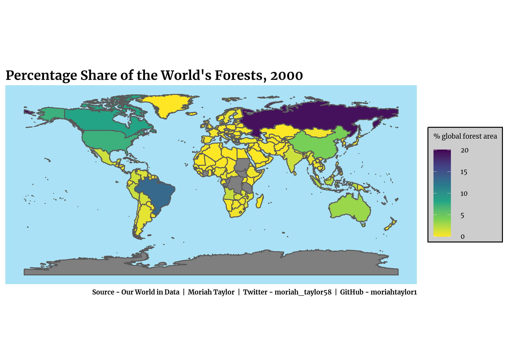
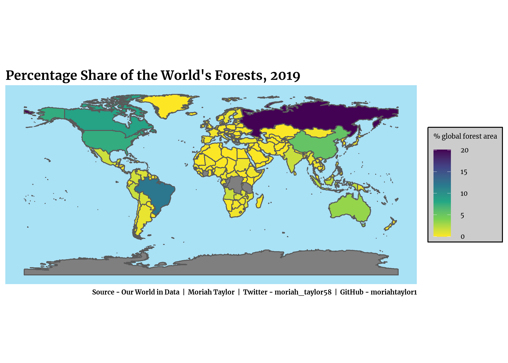

```{r, message=FALSE, warning=FALSE, include=FALSE, echo=FALSE}
library(rmarkdown)  #rmarkdown
```

## This Week's Data
The data this week comes from [Our World in Data](https://ourworldindata.org/forests-and-deforestation).

Hannah Ritchie and Max Roser (2021) - "Forests and Deforestation". Published online at OurWorldInData.org. Retrieved from: 'https://ourworldindata.org/forests-and-deforestation'
  
```{r, message=FALSE, warning=FALSE, include=TRUE}
#load packages
library(tidytuesdayR) #tidy tuesday
library(tidyverse)  #tidy
library(extrafont)  #fonts
library(showtext)  #fonts
library(dplyr)  #dataframes
library(ragg)  #save ggplot
library(rmarkdown)  #rmarkdown
library(cowplot)  #better data visualization
library(googleway)  #google maps
library(ggrepel)  #text labels
library(ggspatial)  #map scale legends
library(lwgeom)  #maps
library(sf)   #maps
library(rnaturalearth)  #map of countries of the world
library(rnaturalearthdata)  #world vector map data
library(viridis)  #colorblind-friendly color scales
library(rgeos)
library(plotly)  #interactive
library(NLP)  #String function
library(scales)
```
  
  
## Load the Data  
```{r, message=FALSE, warning=FALSE, include=TRUE}
#load tidytuesday data
tuesdata <- tidytuesdayR::tt_load(2021, week = 15)
#separate into each dataset
forest <- tuesdata$forest
forest_area <- tuesdata$forest_area
brazil_loss <- tuesdata$brazil_loss
soybean_use <- tuesdata$soybean_use
vegetable_oil <- tuesdata$vegetable_oil

#To assist in mapping, I loaded a dataset from kaggle which has the capitals of world countries along with their 
#latitude and longitude. This data can be found [here](https://www.kaggle.com/nikitagrec/world-capitals-gps)
#load capital data from kaggle
#capitals <- read.csv('concap.csv')
```

```{r, message=FALSE, warning=FALSE, include=TRUE}
#load world data from {rnaturalearth}
world <- ne_countries(scale="medium", type="countries", returnclass="sf")

#rename column in world to enable merging with forest data
names(world)[names(world)=="sovereignt"] <- "entity"
#rename united states of america to united states to enable merging with other datasets
world$entity[world$entity=="United States of America"] <- "United States"

#rename column in capitals to enable merging with world data
#names(capitals)[names(capitals)=="CountryName"] <- "entity"
#change entity column to character
#capitals$entity <- as.character(capitals$entity)
#merge capitals with world data
#world2 <- merge(world, capitals, by="entity", all=TRUE)

#create a column formatted for display in forest_area
strings <- String(round(forest_area$forest_area*100, 3))
forest_area$display_info <- paste0(forest_area$code, " - ", strings, "%")
```
  
 
## Data Visualization  
```{r, message=FALSE, warning=FALSE, include=TRUE}
#load fonts
font_add(family = "bold", "Merriweather-Bold.ttf")
font_add(family = "italic", "Merriweather-Italic.ttf")
font_add(family = "regular", "Merriweather-Regular.ttf")
showtext_auto()

#create plot theme
plot_theme <- theme(
 # titles
  plot.title = element_text(family = "bold", size = 40, color = "black", hjust=0, vjust=0),
  plot.subtitle = element_text(family = "italic", size = 18, color = "black", hjust=0),
  plot.caption = element_text(family = "bold", size = 20, color = "black", hjust = 1),
  
  # panel and plot background
  panel.grid.major = element_blank(),
  panel.grid.minor = element_blank(),
  panel.background = element_rect(fill="#A9e1f5"),
  plot.background = element_blank(),
  
  # axis
  axis.title = element_blank(),
  axis.text = element_blank(),
  axis.ticks = element_blank(),
  
  #legend
  legend.title = element_text(family="regular", size=20),
  legend.text = element_text(family = "regular", size=20),
  legend.background = element_rect(fill="#cccccc", size=0.5, linetype="solid", color="black")
)
```

  
## Annual Change in Forest Area  
The net change in forest cover measures any gains in forest cover – either through natural forest expansion or afforestation through tree-planting – minus deforestation. Countries with a positive change (shown in dark green) are regrowing forest faster than they’re losing it. Countries with a negative change (shown in yellow) are losing more than they’re able to restore.  
  
```{r, message=FALSE, warning=FALSE, include=TRUE}
#select forest area data from 2000
net_forest_area_2000 <- forest %>%
  filter(year==2000)
#merge datasets
net_world_area_2000 <- merge(world, net_forest_area_2000, by="entity", all=TRUE)

#plot forest area for 2000
net_area_plot_2000 <- ggplot(data=net_world_area_2000) + 
  geom_sf(aes(fill=net_forest_conversion)) + 
  scale_fill_gradient(low="yellow", high="#095952", name = "net forest conversion in hectares",
                      labels=label_comma()) +
  #title, subtitle, and caption
  labs(
    title = "Annual Change in Forest Area, 2000",
    caption = "Source - Our World in Data  |  Moriah Taylor  |  Twitter - moriah_taylor58  |  GitHub - moriahtaylor1") +
  plot_theme
  
ggsave("net_area_plot_2000.png",
       plot = net_area_plot_2000,
       device = agg_png(width = 7, height = 5, units = "in", res = 300))
```

```{r, message=FALSE, warning=FALSE, include=TRUE}
#select forest area data from 2015
net_forest_area_2015 <- forest %>%
  filter(year==2015)
#merge datasets
net_world_area_2015 <- merge(world, net_forest_area_2015, by="entity", all=TRUE)

#plot forest area for 2015
net_area_plot_2015 <- ggplot(data=net_world_area_2015) + 
  geom_sf(aes(fill=net_forest_conversion)) + 
  scale_fill_gradient(low="yellow", high="#095952", name = "net forest conversion in hectares",
                      labels=label_comma(), limit=c(-5000000, 2200000)) +
  #title, subtitle, and caption
  labs(
    title = "Annual Change in Forest Area, 2015",
    caption = "Source - Our World in Data  |  Moriah Taylor  |  Twitter - moriah_taylor58  |  GitHub - moriahtaylor1") +
  plot_theme
  
ggsave("net_area_plot_2015.png",
       plot = net_area_plot_2015,
       device = agg_png(width = 7, height = 5, units = "in", res = 300))
```

  
******
  
## Percentage Share of the World's Forests
Forest area is land under natural or planted stands of trees of at least 5 meters in situ, whether productive or not, and excludes tree stands in agricultural production systems. Russia – which has the largest forest area – is home to one-fifth of global forest area. Brazil is the only other country with more than 10% of global forest cover.

```{r, message=FALSE, warning=FALSE, include=TRUE}
#select forest area percentage data from 2000
forest_area_share_2000 <- forest_area %>%
  filter(year==2000)
#merge datasets
world_area_share_2000 <- merge(world, forest_area_share_2000, by="entity", all=TRUE)

#plot forest area percentages for 2000
area_share_plot_2000 <- ggplot(data=world_area_share_2000) + geom_sf(aes(fill=forest_area, text=display_info)) + 
  scale_fill_viridis_c(name = "% global forest area", option="viridis", 
                       direction=-1, limit=c(0,20.1)) +  #colorblind-friendly palette
  #title, subtitle, and caption
  labs(
    title = "Percentage Share of the World's Forests, 2000",
    caption = "Source - Our World in Data  |  Moriah Taylor  |  Twitter - moriah_taylor58  |  GitHub - moriahtaylor1") +
  plot_theme
  
ggsave("area_share_plot_2000.png",
       plot = area_share_plot_2000,
       device = agg_png(width = 7, height = 5, units = "in", res = 300))
```

```{r, message=FALSE, warning=FALSE, include=TRUE}
#select forest area perecentage data from 2019
forest_area_share_2019 <- forest_area %>%
  filter(year==2019)
#merge datasets
world_area_share_2019 <- merge(world, forest_area_share_2019, by="entity", all=TRUE)

#plot forest area percentages for 2019
area_share_plot_2019 <- ggplot(data=world_area_share_2019) + geom_sf(aes(fill=forest_area, text=display_info)) + 
  scale_fill_viridis_c(name = "% global forest area", option="viridis", 
                       direction=-1, limit=c(0,20.1)) + #colorblind-friendly palette
  #title, subtitle, and caption
  labs(
    title = "Percentage Share of the World's Forests, 2019",
    caption = "Source - Our World in Data  |  Moriah Taylor  |  Twitter - moriah_taylor58  |  GitHub - moriahtaylor1") +
  plot_theme
  
ggsave("area_share_plot_2019.png",
       plot = area_share_plot_2019,
       device = agg_png(width = 7, height = 5, units = "in", res = 300))
```


******
#### TidyTuesday

Join the R4DS Online Learning Community in the weekly #TidyTuesday event!
Every week we post a raw dataset, a chart or article related to that dataset, and ask you to explore the data.
While the dataset will be “tamed”, it will not always be tidy! As such you might need to apply various R for Data Science techniques to wrangle the data into a true tidy format.
The goal of TidyTuesday is to apply your R skills, get feedback, explore other’s work, and connect with the greater #RStats community!
As such we encourage everyone of all skills to participate!