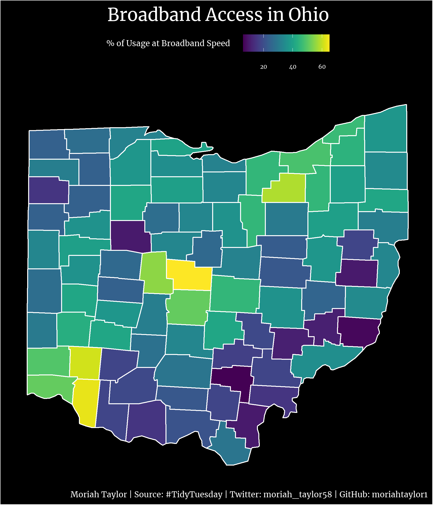
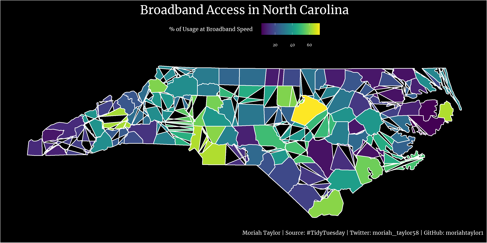

# This Week's Data - Internet Access

The data this week comes from [Microsoft](https://github.com/microsoft/USBroadbandUsagePercentages) by way of [The Verge](https://www.theverge.com/22418074/broadband-gap-america-map-county-microsoft-data).

> If broadband access was a problem before 2020, the pandemic turned it into a crisis. As everyday businesses moved online, city council meetings or court proceedings became near-inaccessible to anyone whose connection couldn’t support a Zoom call. Some school districts started providing Wi-Fi hotspots to students without a reliable home connection. In other districts, kids set up in McDonald’s parking lots just to get a reliable enough signal to do their homework. After years of slowly widening, the broadband gap became impossible to ignore.

Note that to map the areas you will likely need to geocode by zipcode, which can be accomplished with the [`{zipcodeR}` package](https://gavinrozzi.github.io/zipcodeR/). The [`{tigris}`](https://github.com/walkerke/tigris) can also help with Census shapefiles.

`zipcodeR`

> `zipcodeR` is an R package that makes working with ZIP codes in R easier. It provides data on all U.S. ZIP codes using multiple open data sources, making it easier for social science researchers and data scientists to work with ZIP code-level data in data science projects using R.
> 
> The latest update to zipcodeR includes new functions for searching ZIP codes at various geographic levels & geocoding.

```{r setup, include=FALSE}
knitr::opts_chunk$set(echo = TRUE)
```

## Load Packages
```{r echo=TRUE, message=FALSE, warning=FALSE, include=TRUE}
#load packages
library(tidytuesdayR) #tidy tuesday data
library(tidyverse) #wrangling
library(lubridate) #wrangling
library(extrafont) #fonts
library(showtext) #fonts
library(ragg)  #save as png
library(rmarkdown) #markdown
library(maps)  #geocoding
library(ggmap)  #geocoding
library(ggthemes) #custom plot theme
library(viridis)  #colorblind-friendly palette
library(sf)  #geocoding
library(tidycensus)  #geocoding
```

## Load the Data
```{r echo=TRUE, message=FALSE, warning=FALSE, include=TRUE}
tuesdata <- tidytuesdayR::tt_load(2021, week = 20)
```

## Access the Data
```{r echo=TRUE, message=FALSE, warning=FALSE, include=TRUE}
speeds <- tuesdata$broadband
zip_codes <- tuesdata$broadband_zip
```

## Wrangling

```{r echo=TRUE, message=FALSE, warning=FALSE, include=TRUE}
#rename columns
names(speeds) <- c("state", "county_id", "subregion", "broadband_fcc", "broadband_usage")
zip_codes <- zip_codes %>% rename(state = ST,
                            subregion = "COUNTY NAME",
                            county_id = "COUNTY ID",
                            zipcode = "POSTAL CODE",
                            broadband_usage = "BROADBAND USAGE")

#tidy county names into common format
speeds$subregion <- word(speeds$subregion, 1)
speeds$subregion <- tolower(speeds$subregion)
zip_codes$subregion <- word(zip_codes$subregion, 1)
zip_codes$subregion <- tolower(zip_codes$subregion)
```

```{r echo=TRUE, message=FALSE, warning=FALSE, include=TRUE}
#changing usage column to numeric
speeds$broadband_usage <- as.numeric(speeds$broadband_usage)
#creating percentage column
speeds <- speeds %>%
  mutate(broadband_perc = broadband_usage * 100)
```


```{r echo=TRUE, message=FALSE, warning=FALSE, include=TRUE}
#subset data for states of interest
nc <- speeds %>%
  filter(state == "NC")

ohio <- speeds %>%
  filter(state == "OH")

#special case: van wert county
#need to change for merge
ohio[81,3] <- "van wert"
```

```{r echo=TRUE, message=FALSE, warning=FALSE, include=TRUE}
#getting map data for each state that is ggplot-friendly
nc_county <- map_data('county', 'north carolina')
ohio_county <- map_data('county', 'ohio')

nc_state <- map_data('state', 'north carolina')
ohio_state <- map_data('state', 'ohio')

#joining data on common counties
nc_data <- merge(nc_county, nc, on="subregion")
ohio_data <- merge(ohio_county, ohio, on="subregion")


nc_data <- nc_data[order(-nc_data[,5]),]
ohio_data <- ohio_data[order(-ohio_data[,5]),]
```


## Plot Stylizing
```{r echo=TRUE, message=FALSE, warning=FALSE, include=TRUE}
font_add(family = "regular", "Merriweather-Regular.ttf")
showtext_auto()


#themes
my_theme <- theme(
  # title, subtitle, caption
  plot.title = element_text(family="regular", size=55, color="white", vjust=0.5, hjust=0.5),
  plot.subtitle = element_blank(),
  plot.caption = element_text(family="regular", size=25, color="white", hjust=1),

  # panel and plot background
  panel.grid.major = element_blank(),
  panel.grid.minor = element_blank(),
  panel.background = element_rect(fill = "black"),
  plot.background = element_rect(fill = "black"),
  
  # axis
  axis.title = element_blank(),
  axis.text = element_blank(),
  axis.ticks = element_blank(),
  
  #no legend
  legend.position = "top",
  legend.title = element_text(family="regular", size=25, color="white", vjust=0.8),
  legend.background = element_rect(fill="black"),
  legend.text = element_text(family="regular", size=18, color="white", vjust=0.8)
  
)

```

## Making the Plots  
```{r echo=TRUE, message=FALSE, warning=FALSE, include=TRUE} 
nc_plot <- ggplot(nc_data, #county outline and filled
                  aes(x=long, y = lat, fill=broadband_perc, group=as.factor(subregion), color="white")) +
  
  #state outline
  geom_polygon(color="white") +
  
  
  labs(title = "Broadband Access in North Carolina",
      fill = "% of Usage at Broadband Speed",
       caption = "Moriah Taylor | Source: #TidyTuesday | Twitter: moriah_taylor58 | GitHub: moriahtaylor1") +
  
  scale_fill_viridis() + my_theme

# save image
ggsave("nc_broadband.png",
       plot = nc_plot,
       device = agg_png(width = 10, height = 5, units = "in", res = 300))

nc_plot
```


```{r echo=TRUE, message=FALSE, warning=FALSE, include=TRUE} 
oh_plot <- ggplot(ohio_data, #county outline and filled
                  aes(x=long, y = lat, fill=broadband_perc, group=as.factor(subregion), color="white")) +
  
  #state outline
  geom_polygon(color="white") +
  
  
  labs(title = "Broadband Access in Ohio",
      fill = "% of Usage at Broadband Speed",
       caption = "Moriah Taylor | Source: #TidyTuesday | Twitter: moriah_taylor58 | GitHub: moriahtaylor1") +
  
  scale_fill_viridis() + my_theme

# save image
ggsave("oh_broadband.png",
       plot = oh_plot,
       device = agg_png(width = 6, height = 7, units = "in", res = 300))

oh_plot
```

## Final Plots
 