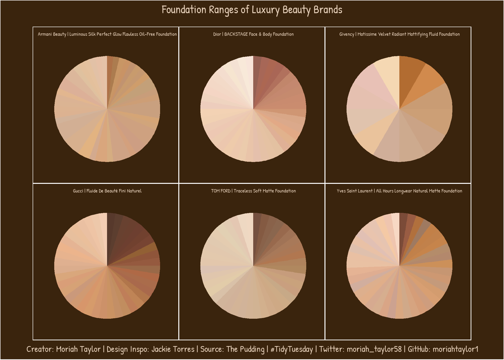

# Tidy Tuesday
#TidyTuesday is a weekly social data project in R which encourages participants to summarize and arrange data to make meaningful charts with ggplot2, tidyr, dplyr, and other tools in the tidyverse ecosystem. More information can be found on this project at https://github.com/rfordatascience/tidytuesday. 

# 2021

### Week 20 - Broadband Speeds [(code)](https://github.com/moriahtaylor1/tidy-tuesday/tree/main/2021_Week20)
&nbsp;&nbsp;&nbsp;&nbsp;  

### Week 19 - Water Access [(code)](https://github.com/moriahtaylor1/tidy-tuesday/tree/main/2021_Week19)

### Week 17 - Netflix [(code)](https://github.com/moriahtaylor1/tidy-tuesday/tree/main/2021_Week17)

### Week 16 - U.S. Post Offices [(code)](https://github.com/moriahtaylor1/tidy-tuesday/tree/main/2021_Week16)

### Week 15 - Deforestation [(code)](https://github.com/moriahtaylor1/tidy-tuesday/tree/main/2021_Week15)
  
  

### Week 14 - Makeup Shades [(code)](https://github.com/moriahtaylor1/tidy-tuesday/tree/main/2021_Week14)
  
  

### Week 13 - UN Votes [(code)](https://github.com/moriahtaylor1/tidy-tuesday/tree/main/2021_Week13)

