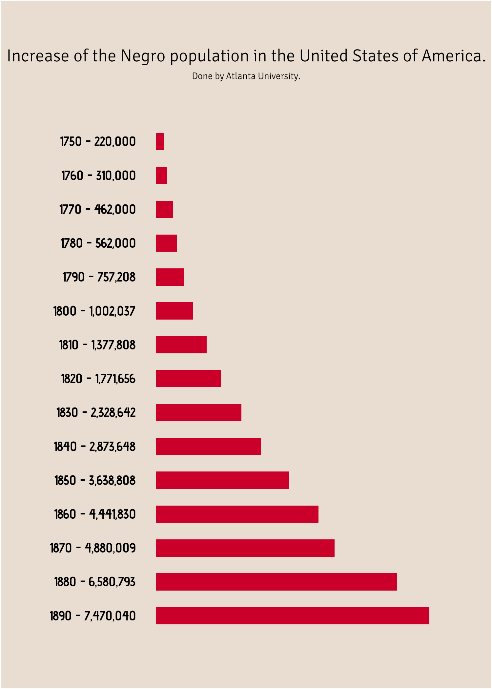
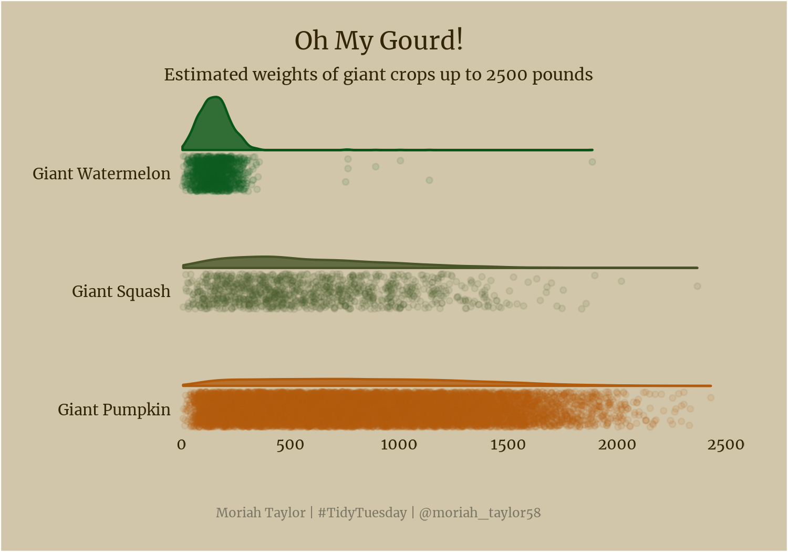

# Tidy Tuesday
#TidyTuesday is a weekly social data project in R which encourages participants to summarize and arrange data to make meaningful charts with ggplot2, tidyr, dplyr, and other tools in the tidyverse ecosystem. More information can be found on this project at https://github.com/rfordatascience/tidytuesday. 

# 2022 

## Week 9 - Alternative Fuel Stations [(code)](https://github.com/moriahtaylor1/tidy-tuesday/tree/main/2022_Week09)

## Week 6 - Tuskegee Airmen and Du Bois Challenge [(code)](https://github.com/moriahtaylor1/tidy-tuesday/tree/main/2022_Week06)
    

## Week 4 - Board Game Ratings [(code)](https://github.com/moriahtaylor1/tidy-tuesday/tree/main/2022_Week04)

## Week 3 - Chocolate Ingredients [(code)](https://github.com/moriahtaylor1/tidy-tuesday/tree/main/2022_Week03)

## Week 2 - Bee Colony Stressors [(code)](https://github.com/moriahtaylor1/tidy-tuesday/tree/main/2022_Week02)

## Week 1 - Bring Your Own Data! [(code)](https://github.com/moriahtaylor1/tidy-tuesday/tree/main/2022_Week01)

# 2021

## Week 52 - Starbucks Drinks [(code)](https://github.com/moriahtaylor1/tidy-tuesday/tree/main/2021_Week52)

## Week 50 - Spiders [(code)](https://github.com/moriahtaylor1/tidy-tuesday/tree/main/2021_Week50)

## Week 47 - Du Bois Recreations [(code)](https://github.com/moriahtaylor1/tidy-tuesday/tree/main/2021_Week47)
  

## Week 46 - {afrilearnr} [(code)](https://github.com/moriahtaylor1/tidy-tuesday/tree/main/2021_Week46)
 

## Week 44 - Ultra Running [(code)](https://github.com/moriahtaylor1/tidy-tuesday/tree/main/2021_Week44)
 

## Week 43 - Giant Crops [(code)](https://github.com/moriahtaylor1/tidy-tuesday/tree/main/2021_Week43)

## Week 42 - Seafood Production [(code)](https://github.com/moriahtaylor1/tidy-tuesday/tree/main/2021_Week42)

## Week 41 - Registered Nurse Wages [(code)](https://github.com/moriahtaylor1/tidy-tuesday/tree/main/2021_Week41)

## Week 40 - NBER Papers [(code)](https://github.com/moriahtaylor1/tidy-tuesday/tree/main/2021_Week40)

## Week 38 - Billboard Top 100 [(code)](https://github.com/moriahtaylor1/tidy-tuesday/tree/main/2021_Week38)

## Week 37 - Formula One [(code)](https://github.com/moriahtaylor1/tidy-tuesday/tree/main/2021_Week37)
 
 

## Week 36 - Australian Bird Baths [(code)](https://github.com/moriahtaylor1/tidy-tuesday/tree/main/2021_Week36)

## Week 35 - Lemurs [(code)](https://github.com/moriahtaylor1/tidy-tuesday/tree/main/2021_Week35)

## Week 34 - Star Trek [(code)](https://github.com/moriahtaylor1/tidy-tuesday/tree/main/2021_Week34)
 

## Week 33 - Infrastructure Spending [(code)](https://github.com/moriahtaylor1/tidy-tuesday/tree/main/2021_Week33)

## Week 32 - Paralympics[(code)](https://github.com/moriahtaylor1/tidy-tuesday/tree/main/2021_Week32)

## Week 31 - Olympics [(code)](https://github.com/moriahtaylor1/tidy-tuesday/tree/main/2021_Week31)
  

## Week 30 - U.S. Droughts [(code)](https://github.com/moriahtaylor1/tidy-tuesday/tree/main/2021_Week30)

## Week 29 - Scooby Doo [(code)](https://github.com/moriahtaylor1/tidy-tuesday/tree/main/2021_Week29)
  
  

## Week 27 - Animal Rescues [(code)](https://github.com/moriahtaylor1/tidy-tuesday/tree/main/2021_Week27)

## Week 26 - Public Park Access [(code)](https://github.com/moriahtaylor1/tidy-tuesday/tree/main/2021_Week26)

## Week 25 - WEB Du Bois and Juneteenth [(code)](https://github.com/moriahtaylor1/tidy-tuesday/tree/main/2021_Week25)

## Week 24 - Great Lakes Fish [(code)](https://github.com/moriahtaylor1/tidy-tuesday/tree/main/2021_Week24)

## Week 23 - Survivor TV Show [(code)](https://github.com/moriahtaylor1/tidy-tuesday/tree/main/2021_Week23)

## Week 22 - Mario Kart World Records [(code)](https://github.com/moriahtaylor1/tidy-tuesday/tree/main/2021_Week22)

## Week 21 - Ask a Manager Salary Survey [(code)](https://github.com/moriahtaylor1/tidy-tuesday/tree/main/2021_Week21)

 

## Week 20 - U.S. Broadband Speeds [(code)](https://github.com/moriahtaylor1/tidy-tuesday/tree/main/2021_Week20)
&nbsp;&nbsp;&nbsp;&nbsp;

## Week 19 - Water Access Points [(code)](https://github.com/moriahtaylor1/tidy-tuesday/tree/main/2021_Week19)

## Week 17 - Netflix Titles [(code)](https://github.com/moriahtaylor1/tidy-tuesday/tree/main/2021_Week17)

## Week 16 - U.S. Post Offices [(code)](https://github.com/moriahtaylor1/tidy-tuesday/tree/main/2021_Week16)

## Week 15 - Global Deforestation [(code)](https://github.com/moriahtaylor1/tidy-tuesday/tree/main/2021_Week15)
  
  

## Week 14 - Makeup Shades [(code)](https://github.com/moriahtaylor1/tidy-tuesday/tree/main/2021_Week14)
  
  

## Week 13 - UN Votes [(code)](https://github.com/moriahtaylor1/tidy-tuesday/tree/main/2021_Week13)

